<div align="center">

<a href="https://claude.ai/artifact/LUfXvEUGWGTy4fSnqc8ajN">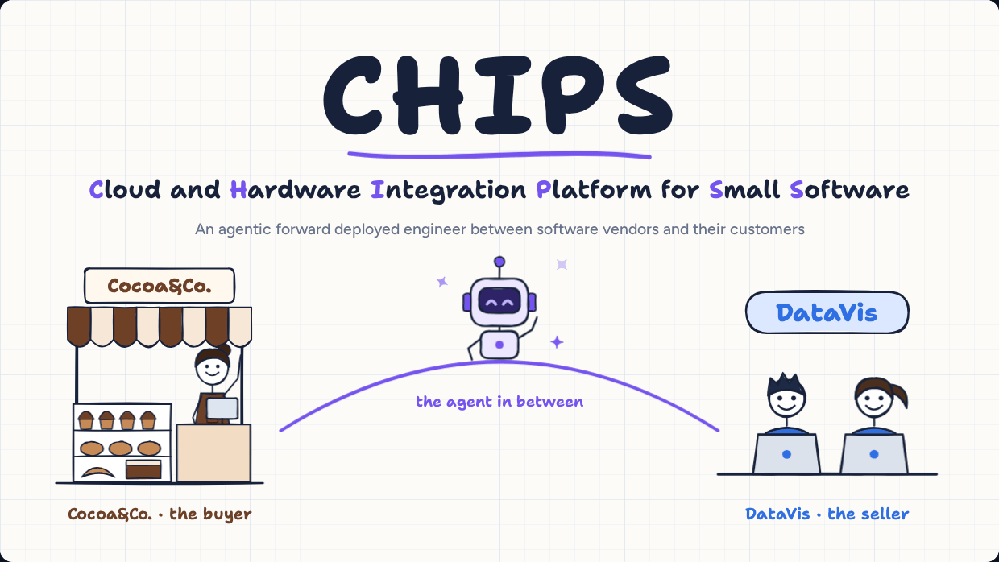</a>

# CHIPS

### Cloud and Hardware Integration Platform for Small Software

**An agentic forward deployed engineer for small software.**<br>
CHIPS matches small businesses with small software vendors, adapts the vendor's product to each customer's workflow, deploys it with tests, and keeps it working through every upgrade.

[](https://origin-weekend-fall-2026.devpost.com/)
[](#built-for-origin-weekend-fall-2026)
[](#built-for-origin-weekend-fall-2026)

[](#run-it-locally)
[](#run-it-locally)
[](#deploy-on-netlify)

**[Try the prototype](https://claude.ai/artifact/GGv4Bq9YqY2rTQuVPijSfQ)** &nbsp;·&nbsp; **[Watch the 5-minute pitch](https://claude.ai/artifact/LUfXvEUGWGTy4fSnqc8ajN)** &nbsp;·&nbsp; **[Read the pitch script](docs/pitch-script.md)**

</div>

<br>

<p align="center">
  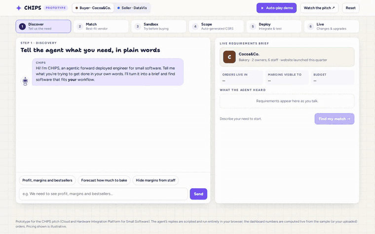
  <br>
  <sub>The prototype's <b>Auto-play demo</b>, sped up 3×: one bakery goes from a plain-English request to a tested, deployed dashboard with no engineering hours.</sub>
</p>

---

## Contents

- [Built for Origin Weekend Fall 2026](#built-for-origin-weekend-fall-2026)
- [The problem](#the-problem)
- [What CHIPS does](#what-chips-does)
- [How CHIPS answers Prompt F](#how-chips-answers-prompt-f)
- [The prototype, step by step](#the-prototype-step-by-step)
- [Business model](#business-model)
- [Why we win](#why-we-win)
- [Our first 100 customers](#our-first-100-customers)
- [What's real and what's simulated](#whats-real-and-whats-simulated)
- [What's next](#whats-next)
- [Run it locally](#run-it-locally) · [Deploy on Netlify](#deploy-on-netlify) · [Repo layout](#repo-layout)
- [Sources](#sources)

---

## Built for Origin Weekend Fall 2026

CHIPS is our team's submission to **[Origin Weekend Fall 2026](https://origin-weekend-fall-2026.devpost.com/)**, a four-day startup hackathon at USC (September 24–28, 2026) where 200+ students from across campus team up to take a startup from problem to pitch in one weekend.

We chose **Prompt F: A Cloud for Small Software.** The prompt observes that agents have made purpose-built tools easy to build but still hard to deploy and share. AWS and Azure were designed for Big Software, and the hard problems are customizing the environment for each company, auth and permissions, and letting nontechnical users share software safely.

This repo is our **demo for the submission**. It has two parts:

| | What it is | Where |
|---|---|---|
| **Prototype** | A clickable, end-to-end walkthrough of CHIPS for one buyer and one seller, with live-computed dashboards and an auto-play mode | [`index.html`](index.html) → site root |
| **Pitch film** | A narrated, hand-drawn pitch in 17 scenes (about 5 minutes) that covers every part of the judging rubric | [`pitch/index.html`](pitch/index.html) → `/pitch/` |
| **Pitch script** | The narration as speaker notes, with a source for every statistic | [`docs/pitch-script.md`](docs/pitch-script.md) |

<details>
<summary><b>How the demo maps to the judging rubric</b></summary>
<br>

| Rubric area | Where to find it |
|---|---|
| **Problem & Customer Insight**: clear problem, target customers, evidence | Pitch acts 1–3: the buyer (Cocoa&Co., a growing bakery), the seller (DataVis, a 2-person analytics startup) and the research on buyer regret and vendor capacity. See [The problem](#the-problem). |
| **Solution & Business Model**: fit, differentiation, who pays, first 100 customers | Pitch acts 4–14 and the prototype. See [What CHIPS does](#what-chips-does), [Business model](#business-model), [Why we win](#why-we-win) and [Our first 100 customers](#our-first-100-customers). |
| **Execution & Communication**: prototype, clear pitch, what comes next | The working prototype, the pitch film, and a 90-day plan with the metrics we'll track. See [What's next](#whats-next). |

</details>

---

## The problem

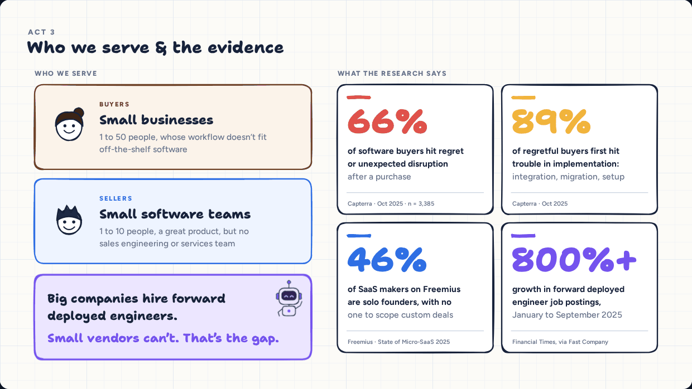

**Buyers:** small businesses (1 to 50 people) whose workflows don't fit off-the-shelf software. Today they get three bad options: bend their workflow to generic SaaS, pay for custom engineering, or build and maintain internal tools themselves.

**Sellers:** small software teams (1 to 10 people) with a great product and no sales engineering or services team to scope, customize and support small deals. So they turn those deals away.

**The evidence:**
- **66%** of 3,385 software buyers hit regret or unexpected disruption after a purchase, and **89%** of those who regretted a purchase first hit trouble during implementation (Capterra, Oct 2025).
- **45.7%** of SaaS makers on Freemius are solo founders, with no one to scope custom deals (Freemius, State of Micro-SaaS 2025).
- Big companies solve implementation with **forward deployed engineers**, a role whose job postings grew **800%+** from January to September 2025 (Financial Times, via Fast Company).

> Big companies hire forward deployed engineers. Small vendors can't. That's the gap.

---

## What CHIPS does

CHIPS gives every small software vendor an AI forward deployed engineer and a cloud built to run one-customer customizations safely.

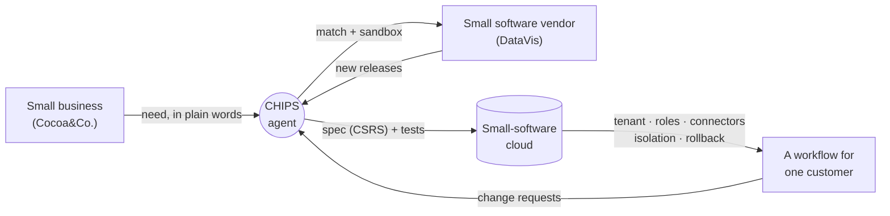

1. **Discover.** The buyer describes the need in plain words. The agent asks three follow-up questions and turns the answers into a requirements brief.
2. **Match.** Every vendor is scored against the brief: what the core product already does, what is configuration, and what needs a small custom workflow.
3. **Sandbox.** The agent reads the vendor's codebase, exposes its services, and builds a live preview on the buyer's own data. The buyer keeps only the services they need.
4. **Scope.** The agent writes a complete spec (a CSRS) with rules and generated tests. Humans only verify it and approve the price.
5. **Deploy.** Either a custom dashboard inside the vendor's product, or an API / MCP integration into the buyer's own tools, with every generated test passing.
6. **Live.** After go-live the agent stays on both sides: it turns change requests into tested configuration, checks every customization against new vendor releases, and flags repeated requests that should become core features.

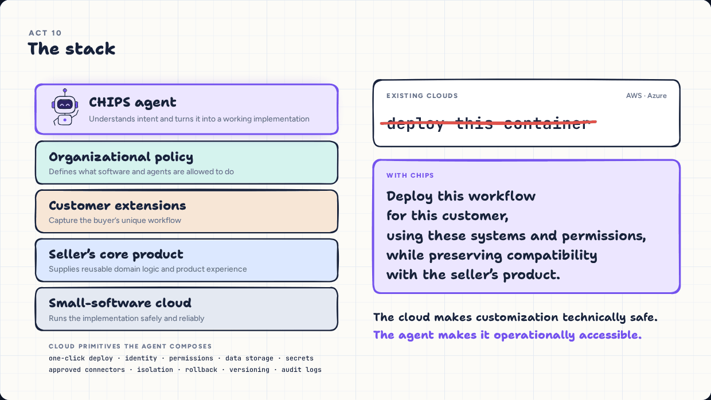

---

## How CHIPS answers Prompt F

| What Prompt F asks for | How CHIPS answers it | Where to see it |
|---|---|---|
| A home for **small software**: tools for one team or a handful of users | The unit of work is one customer's workflow, such as a dashboard for a bakery's two owners, built on a vendor's product | Prototype steps 3–5 |
| Software that is **easy to build but hard to deploy and share** | The agent deploys from an approved spec in one step: tenant, connectors, roles and tests | Prototype step 5 |
| A cloud that **deletes the complexity** of AWS and Azure | Instead of "deploy this container", you ask CHIPS to "deploy this workflow for this customer, using these systems and permissions" | Pitch: *The stack* |
| **Every company customizes its environment** | An organizational-policy layer and customer extensions sit on top of the vendor's core product, so each customization is an extension rather than a fork | Pitch: *The stack*; prototype step 4 |
| **Auth and permissions are hard** | Roles and field-level rules come from plain English ("hide margins from staff") and are enforced with generated tests | Prototype steps 3–5 |
| **Nontechnical users sharing code safely** | Buyers never touch code. Requests like "give contractors access, but hide financial fields" are classified, tested and shipped, or sent to the vendor when they fall outside the product | Prototype step 6 |

---

## The prototype, step by step

Press **Auto-play demo** in the top bar to watch the whole loop, or click through it yourself. Switch between the **Buyer** and **Seller** views at any point.

<table>
  <tr>
    <td width="50%">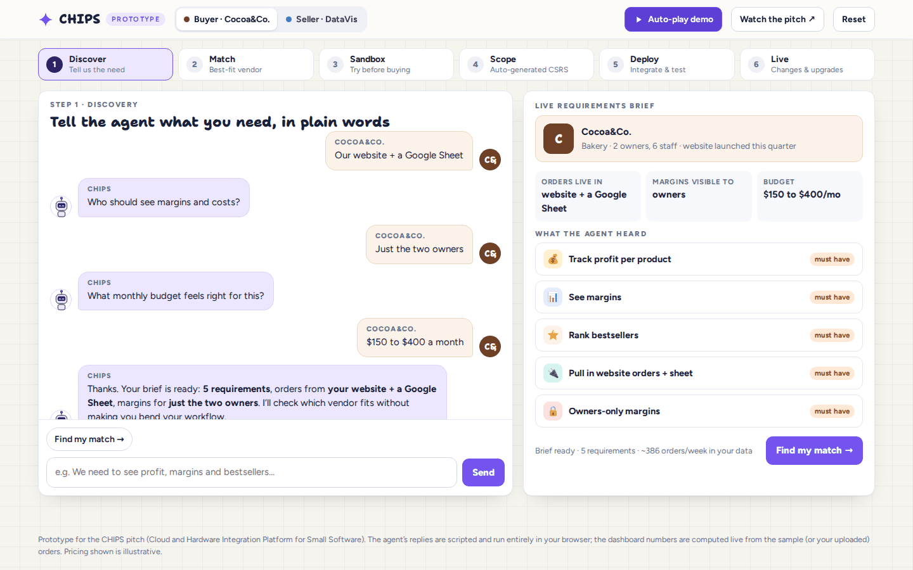<br><b>1 · Discover.</b> A plain-English need becomes a live requirements brief.</td>
    <td width="50%">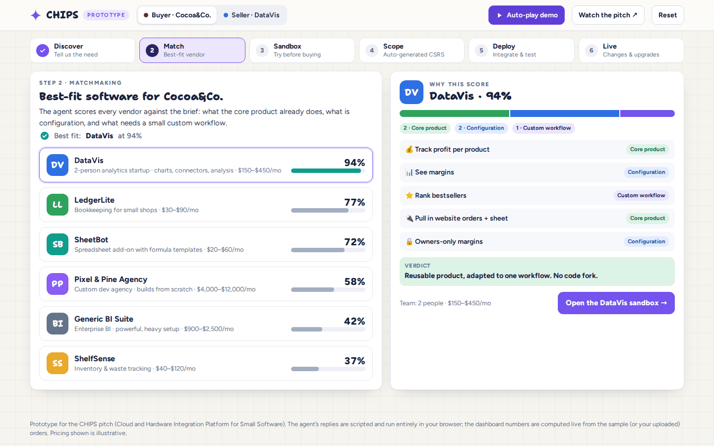<br><b>2 · Match.</b> Vendors scored by core product, configuration and custom workflow, with the reasoning shown.</td>
  </tr>
  <tr>
    <td>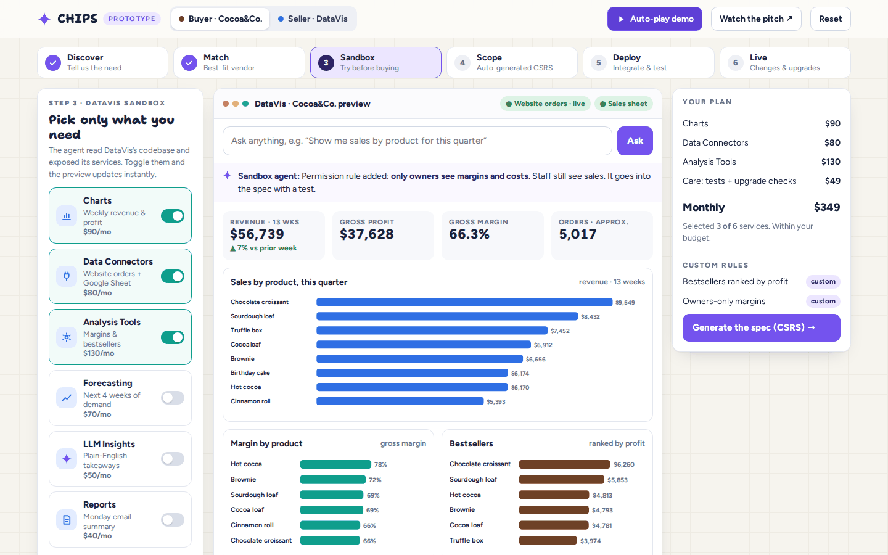<br><b>3 · Sandbox.</b> Toggle the vendor's services, ask questions in plain English, add rules. The numbers are computed live from the data.</td>
    <td>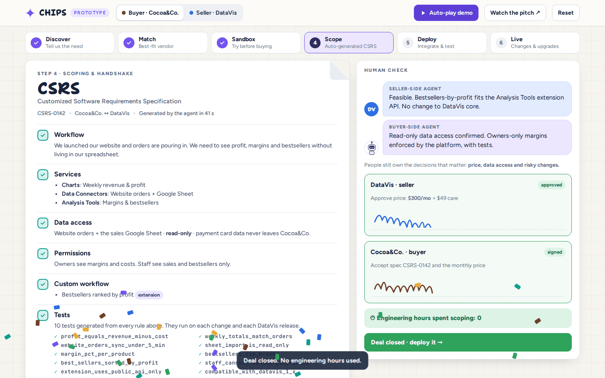<br><b>4 · Scope.</b> An auto-generated spec (CSRS) with rules, tests and pricing, signed by both sides.</td>
  </tr>
  <tr>
    <td>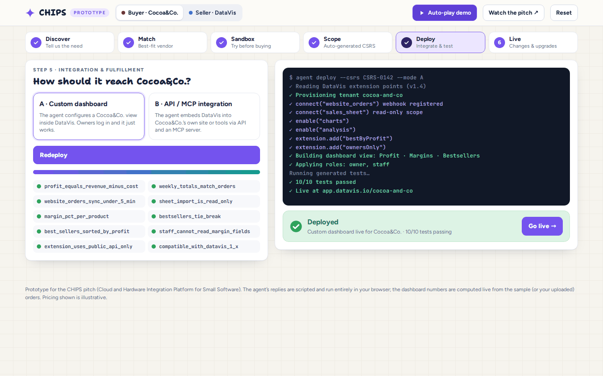<br><b>5 · Deploy.</b> Provisioning, connectors, roles, and every generated test passing.</td>
    <td>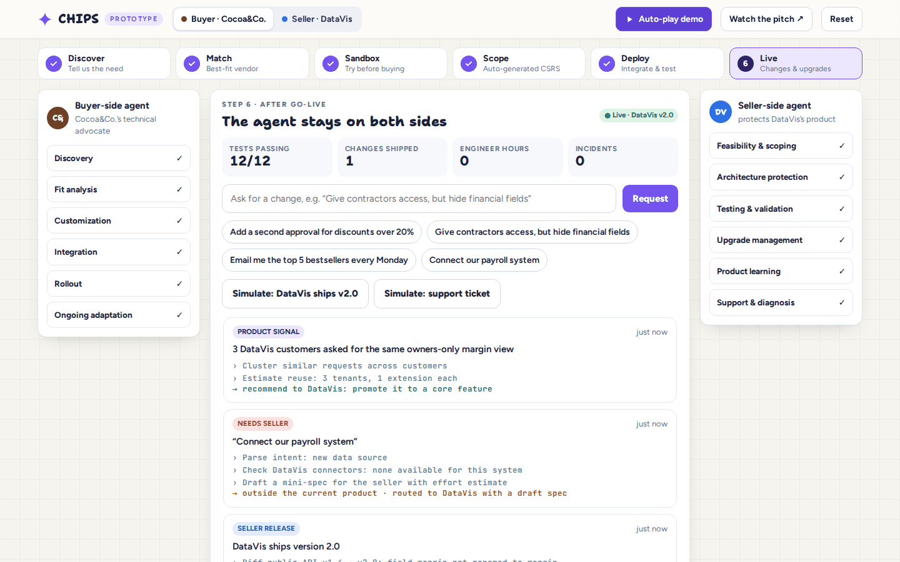<br><b>6 · Live.</b> Change requests, vendor upgrades and support tickets. Anything outside the product goes to the vendor with a draft spec.</td>
  </tr>
</table>

<p align="center">
  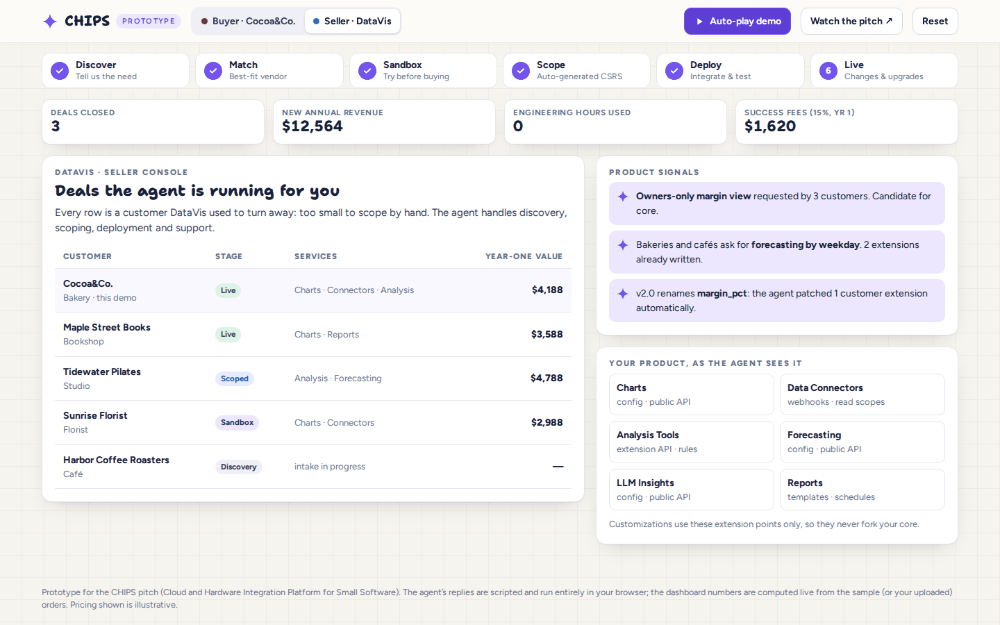<br>
  <sub><b>Seller console.</b> The vendor's view: deals it used to turn away, now closed and supported by the agent.</sub>
</p>

**Try it with your own data:** in the sandbox, upload a CSV with columns `date, product, qty, price, cost` (`cost` and `date` are optional) and every chart recalculates. Use **Sample CSV** to see the format.

---

## Business model

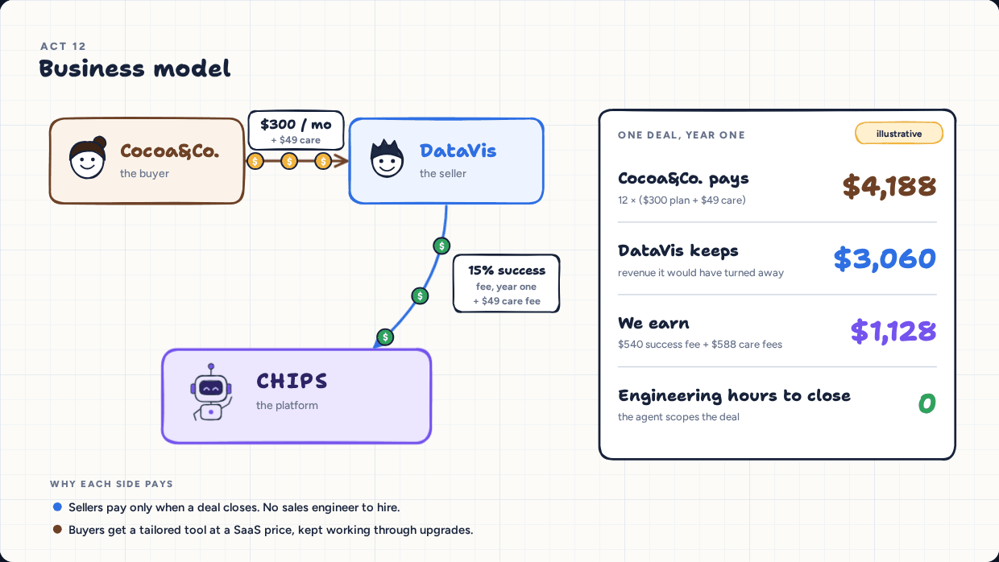

- **Sellers pay a 15% success fee** on a deal's first-year value, and only when the deal closes. They don't need to hire a sales engineer.
- **Buyers pay a $49/month care fee** per live customization, added to the vendor's price. It covers tests and upgrade checks, so the tailored tool keeps working.

**One deal, year one (illustrative):** On a $300-a-month plan, Cocoa&Co. pays **$4,188** (12 × ($300 + $49)). DataVis keeps **$3,060** of revenue it would have turned away, and CHIPS earns **$1,128** ($540 success fee + $588 care fees). No engineering hours are spent.

> Pricing is an illustrative proposal that we will test in customer interviews. It has not been validated yet.

---

## Why we win

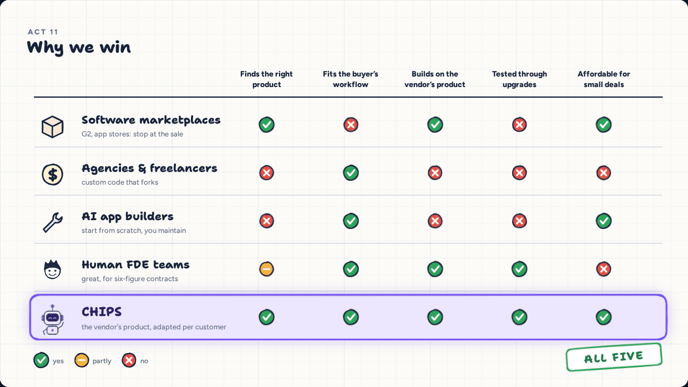

| | Finds the right product | Fits the buyer's workflow | Builds on the vendor's product | Tested through upgrades | Affordable for small deals |
|---|:-:|:-:|:-:|:-:|:-:|
| Software marketplaces (G2, app stores) | ✓ | ✗ | ✓ | ✗ | ✓ |
| Agencies & freelancers | ✗ | ✓ | ✗ | ✗ | ✗ |
| AI app builders | ✗ | ✓ | ✗ | ✗ | ✓ |
| Human forward deployed engineers | partly | ✓ | ✓ | ✓ | ✗ |
| **CHIPS** | **✓** | **✓** | **✓** | **✓** | **✓** |

Marketplaces stop at the sale. Agencies write custom code that forks. AI app builders start from scratch, and you maintain the result. Human forward deployed engineers work, but only for six-figure contracts. CHIPS customizes the vendor's own product, tests every change, and carries it through upgrades, on a bakery's budget.

---

## Our first 100 customers

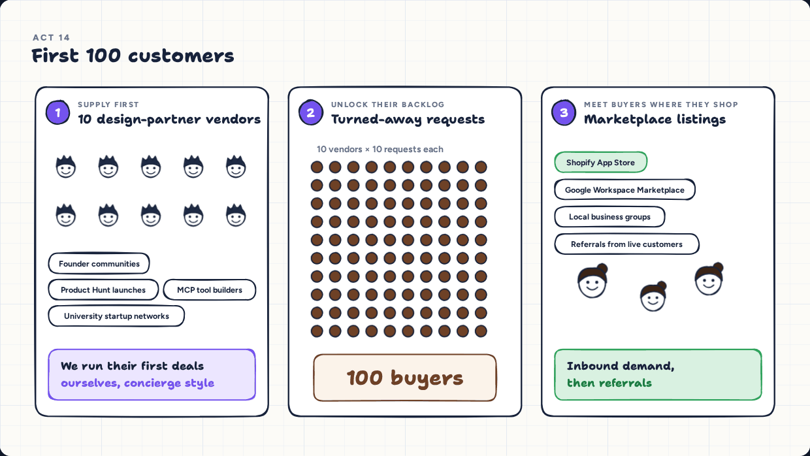

1. **Supply first: 10 design-partner vendors.** We recruit them from founder communities, Product Hunt launches, MCP tool builders and university startup networks, then run their first deals ourselves, concierge style.
2. **Unlock their backlog.** Each vendor hands us the requests it has been turning away. Ten vendors with ten requests each gives us 100 buyers.
3. **Meet buyers where they shop.** We list on marketplaces small businesses already use, starting with the Shopify App Store and Google Workspace Marketplace, then grow through local business groups and referrals from live customers.

---

## What's real and what's simulated

We want judges and visitors to know exactly what they're looking at.

| Real | Simulated |
|---|---|
| The full buyer and seller flow runs in the browser, including the mobile layout | The agent's replies are scripted. There is no LLM call, backend or API key |
| Dashboard numbers are **computed live** from a synthetic 13-week order history, or from any CSV you upload | Cocoa&Co., DataVis and the other vendors are fictional |
| Vendor fit scores come from a capability model weighted by must-have vs nice-to-have requirements | The deployment terminal, test runs, releases and tickets are animations of how the agent would work |
| The spec (CSRS), rules and test names are generated from the services and rules you pick | Pricing is illustrative |
| The research statistics are real and cited below | Customer interviews are the next step: we have not run them yet |

---

## What's next

| When | Milestone |
|---|---|
| **Now** | A clickable prototype of the full loop |
| **Next 30 days** | 20 buyer and 20 vendor interviews to test the problem and our pricing |
| **Days 30–60** | 3 concierge pilots with design-partner vendors |
| **By day 90** | First paid deployments |

**What we'll measure:** time to go-live, the share of requests handled without an engineer, and breakages when vendors ship upgrades.

---

## Run it locally

No dependencies and no build step. Fonts load from Google Fonts, and the film's hand-drawn look uses [rough.js](https://roughjs.com/) from jsDelivr.

```bash
git clone https://github.com/Sparshg3011/CHIPS.git
cd CHIPS
python3 -m http.server 8000
# prototype:  http://localhost:8000/
# pitch film: http://localhost:8000/pitch/
```

Serve it over HTTP rather than opening the file directly, so the narration clips load.

## Deploy on Netlify

1. In Netlify, choose **Add new site → Import an existing project → GitHub** and pick this repo.
2. Leave **Build command** empty. The **Publish directory** is `.` (already set in [`netlify.toml`](netlify.toml)).
3. Deploy. The prototype is served at the site root and the film at `/pitch/`. Every push to `main` redeploys.

## Repo layout

```
CHIPS/
├── index.html            # the prototype (site root)
├── pitch/
│   ├── index.html        # the narrated pitch film
│   └── vo/               # 17 narration clips, one per scene
├── docs/
│   ├── pitch-script.md   # narration as speaker notes, with sources
│   └── images/           # screenshots and the demo GIF used in this README
├── netlify.toml          # static publish, no build step
└── README.md
```

---

## Sources

- Capterra, *2026 Software Buying Trends Report* (Oct 7, 2025; 3,385 software buyers in 11 countries): 66% experienced regret or unexpected disruption after a purchase; 89% of buyers who regretted a purchase first hit an unexpected implementation disruption. [Business Wire](https://www.businesswire.com/news/home/20251007148096/en/)
- Capterra, *2025 Tech Trends Survey* (Aug 2024; 3,500 respondents): about 60% of SMBs made a regretful software purchase in the past 18 months, most often blaming poor implementation. [Capterra](https://www.capterra.com/resources/tech-trends-smb-enterprise-software-purchase-tips/)
- Freemius, *State of Micro-SaaS 2025*: 45.7% of SaaS makers on Freemius are solo founders. [Freemius](https://freemius.com/blog/state-of-micro-saas-2025/)
- Financial Times, via Fast Company: job postings for forward deployed engineers rose more than 800% from January to September 2025. [Fast Company](https://www.fastcompany.com/91435680/postings-for-this-ai-job-are-up-800)

<br>

<div align="center">
<sub>Built in one weekend for <a href="https://origin-weekend-fall-2026.devpost.com/">Origin Weekend Fall 2026</a> at USC · Prompt F: A Cloud for Small Software</sub>
</div>
